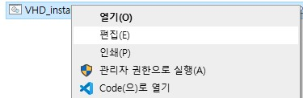
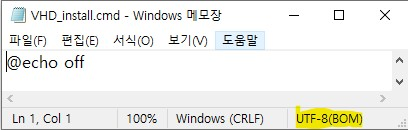
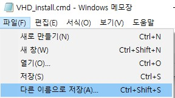
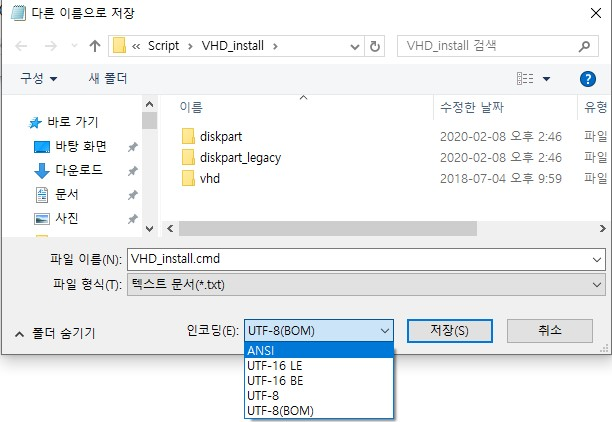
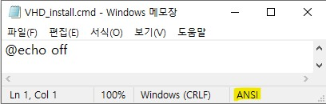

# 파일 인코딩 변경방법

## 개요
* `EUC-KR`인 경우 명령 프롬프트에서는 안깨지지만 Git에서는 한글이 깨지는 문제가 있습니다.
* `UTF-8`인 경우 명령 프롬프트에서 한글이 깨지는 문제가 있습니다.
* 그래서 Github에서 클론한 스크립트를 사용하기 전에 인코딩을 변경하는 작업을 수행해야 하는데, 그 방법에 대해 설명드립니다.

## Step by step
1. 파일을 우클릭해서 편집을 누릅니다. (편집이 없으면 메모장으로 열어도 됩니다.)

2. 메모장으로 열리면 현재 인코딩 방식이 유니코드임을 알 수 있습니다.

3. 파일 -> 다른 이름으로 저장을 클릭합니다.

4. 파일 인코딩을 변경한 뒤, 저장합니다.

5. 인코딩이 변경된 것을 확인합니다.
